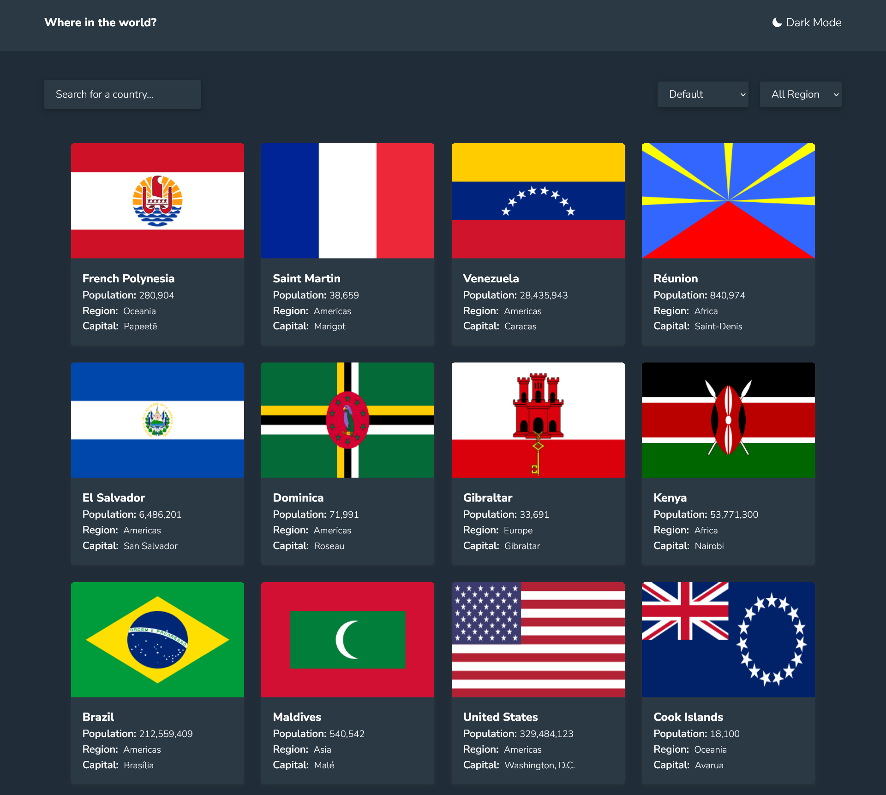

# Country API Explorer - ReactJS Project 🌍

Welcome to the Country API Explorer, a dynamic web application built using ReactJS, CSS, and Axios! This project provides an interactive platform to explore countries around the world, integrating seamless search, filter, and sort functionalities. Plus, it offers a stylish dark mode for a visually pleasing experience, day or night.

## Features 🚀

- **Search:** Effortlessly find any country using the search feature.
- **Filter & Sort:** Customize your view by filtering countries based on various criteria and sorting them according to your preferences.
- **Dark Mode:** Experience the application in a visually appealing dark mode.

## Technologies Used 💻

- **ReactJS:** Built using the popular JavaScript library for building user interfaces.
- **CSS:** Styled with CSS for a sleek and responsive design.
- **Axios:** Utilized Axios for making asynchronous HTTP requests to fetch country data.
- **Prop Type Validation:** Implemented Prop Type validation to ensure data consistency and enhance project reliability.

## Preview 📸



## Live Project 🌐

Experience the Country API Explorer live: [Live Demo](https://rest-country-api-reactjs-project.netlify.app/)

## How to Use 🌟

1. **Clone the Repository:**

   ```
   git clone [repository_url]
   ```

2. **Install Dependencies:**

   ```
   npm install
   ```

3. **Run the Application:**

   ```
   npm run dev
   ```

4. **Explore the Countries:**
   - Use the search bar to find specific countries.
   - Apply filters and sorting options to customize your view.
   - Enjoy the application in both light and dark modes.

## Feedback and Support 🙌

Have feedback or questions? Feel free to open an issue or reach out via email. Your input is valuable and helps enhance the project.

---

Thank you for exploring the Country API Explorer! Let's dive into the diverse world of countries together. 🌎✨
